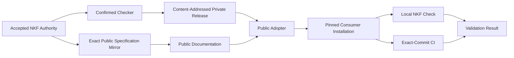

# NKF Release Documentation And Adoption

- **Task:** `NKF-008`
- **Design Disposition:** Adopted
- **Adopting Decision:** `ADR-0064`
- **Proposal Authority Effect:** ADR 0064 adopts this direction without making
  it normative NKF 0.1 meaning
- **Authority Boundary:** The Human Product Owner accepted the NKF-008 outcome
  and delegated technical completion. This Design proposes the exact
  publication and adoption mechanics; it does not publish, confirm, or
  establish conformance by existing.

## Design Kind Problem And Scope

NKF 0.1 has an accepted and confirmed checker, an accepted deterministic
eight-file release archive contract, and a self-hosted repository. Its
previous Github prerelease implements an older authority and checker snapshot,
however. There is no current release pin, no one-operation consumer installer,
and no public explanation a user can read without access to the private NKF
repository.

This Design covers:

- rebinding and publishing the current internal checker release;
- selecting and recording a recommended immutable release;
- publishing an explanatory public documentation set;
- installing the pinned release, AI-neutral guidance, portable skills, host
  adapters, one local command, and a continuous-integration workflow without
  manual file assembly;
- checking, diagnosing, deliberately updating, and recovering an adoption;
  and
- exercising the complete path through the authorized NKF self-hosting
  repository.

This Design does not change native NKF 0.1 meaning, add files to the normative
eight-file release archive, make the private checker public, create a
selectable General Root Profile, activate protected-branch enforcement, or
authorize changes to an external consumer repository.

## Governing Inputs And Constraints

- The accepted normative Markdown Specification and its digest-bound YAML
  companion remain the NKF 0.1 authority pair.
- The release archive defined by ADRs 0042 through 0048 contains exactly eight
  files and remains the sole native NKF distribution unit.
- A release tag, asset URL, Github release page, documentation site, installer,
  and recommended-release catalog are locators or derived Realizations, not
  NKF authority.
- Consumers trust a full expected archive SHA-256, never a moving branch,
  mutable `latest` label, or locator alone.
- Release publication, documentation publication, consumer installation, CI
  execution, and validation results are separate operational facts.
- Acceptance, Design adoption, confirmed Realization, and snapshot conformance
  remain separate claims.
- The current release channel is a private Github prerelease because NKF 0.1
  is pre-stable and currently intended for the Human Product Owner's projects.
- Public documentation may explain and mirror exact public-safe authoritative
  bytes but may not expose private repository contents, credentials, consumer
  knowledge, local paths, or operational data.
- NKF-012, not this Task, owns required-check protection, mandatory
  pull-request approval, bypass policy, and blocked-invalid-candidate proof.
- The public adopter supports Product and Technology bundles only. Common
  Specification rules are inherited through either concrete Root Profile;
  General is not selectable.
- Node.js 22 or later is the release checker runtime.

## Proposed Direction

### Native Release Remains Fixed

The current checker is rebound through a new confirmation Decision that names
its exact source commit and executable SHA-256. The existing package
configuration is updated to that Decision and to the current accepted
Markdown, executable YAML, and four Schema digests.

A clean exact source commit produces the already accepted deterministic
archive:

```text
nourd-nkf-sha256-<full-archive-sha256>.tar
```

The archive is independently verified before upload. Its derived
`release-sha256-<full-archive-sha256>` tag is published as a private Github
prerelease targeting the exact release commit. Existing releases are retained
as historical predecessor publications.

No installer, public guide, AI adapter, or consumer state is added to this
archive. Doing so would silently revise the accepted release contract.

### Recommended Internal Release Catalog

The NKF repository contains one derived machine-readable catalog at
`release/recommended.json`. It records:

- contract identity `nkf.recommended-release`;
- NKF version `0.1`;
- full archive SHA-256;
- derived tag and asset name;
- exact source commit;
- exact checker SHA-256;
- release URL;
- publication visibility and prerelease state; and
- the public adopter SHA-256 that knows how to install it.

The catalog is current repository Realization state, not native NKF authority.
Changing the recommendation requires a deliberate reviewed commit. The
installer never discovers or follows this catalog at check time: the selected
values are copied into the consumer pin.

### Public Documentation Is A Derived Publication

The private NKF repository owns the reviewed publication source under
`public-docs/`. A dedicated public repository,
`kaveh6202/Nourd.NKF.Docs`, publishes only that allowlisted tree.

The public repository is a CommonMark and Mermaid publication surface. Github
renders it directly, so no generated site framework, runtime, analytics,
cookies, or deployment credential is required. The source tree contains:

```text
public-docs/
  README.md
  concepts/
    authority-and-lifecycle.md
    topology.md
  guides/
    adopt-and-validate.md
    update-and-recover.md
  examples/
    product/
      README.md
    technology/
      README.md
  reference/
    nkf-0.1.md
    publication.json         # generated publication binding
  tools/
    nourd-nkf-adopt.mjs
```

`reference/nkf-0.1.md` is byte-identical to the accepted normative
Specification. The documentation identifies it as an exact digest-bound
mirror, states the authoritative private source path and digest without
exposing the repository, and explains that an altered mirror loses the
binding rather than becoming new authority.

`reference/publication.json` is a closed derived publication manifest generated
only in the publication staging tree; it is not an input committed beneath
`public-docs/`. It binds the NKF version, documentation source commit,
normative Markdown digest, internal release archive digest, checker
availability, adopter digest, every other published file digest, and the
non-authoritative role of explanatory content. Excluding the generated
manifest from its own file list and from the source commit avoids both content
and Git-commit cycles.

A deterministic publisher:

1. requires a clean exact private source commit;
2. verifies the public-doc manifest and all allowlisted bytes;
3. rejects filesystem paths, credentials, non-allowlisted files, symlinks, and
   sensitive repository material;
4. creates or updates only the dedicated public repository;
5. commits the exact publication tree with its private source commit recorded;
   and
6. verifies the remote public bytes and commit after push.

### One Self-Contained Consumer Adopter

`dist/nourd-nkf-adopt.mjs` is a deterministic, bundled, public-safe Node.js
executable. It contains the accepted release-verification logic and portable
integration templates but no checker bytes or private release credential.

The supported interface is:

```text
node nourd-nkf-adopt.mjs install \
  --project <project-root> \
  --archive <release-archive> \
  --sha256 <full-release-sha256>

node nourd-nkf-adopt.mjs install \
  --project <project-root> \
  --github-repository kaveh6202/Nourd.NKF \
  --sha256 <full-release-sha256>

npm run nkf:check

node .nourd/tools/nkf/nourd-nkf-adopt.mjs status --project .

node .nourd/tools/nkf/nourd-nkf-adopt.mjs update \
  --project . \
  --archive <new-release-archive> \
  --sha256 <new-full-release-sha256>
```

The Github form derives the tag and asset name from the expected digest and
uses the authenticated `gh` CLI to download the private asset. The local
archive form supports offline installation and testing. Both paths verify the
full independent digest before inspecting any archive content.

Install performs one transaction:

1. resolve and validate the project root, `.nourd`, bundle, knowledge root,
   and concrete Product or Technology Root Profile;
2. verify the complete native release archive and embedded manifest;
3. copy the exact archive under
   `.nourd/tools/nkf/releases/<content-addressed-asset-name>`;
4. copy the exact adopter under
   `.nourd/tools/nkf/nourd-nkf-adopt.mjs`;
5. write `.nourd/nkf-release.json` with the immutable release and adopter
   pins;
6. install the neutral authoring protocol, portable skill representations,
   thin host adapters, adapter registry, and integration verifier;
7. create a minimal private `package.json` when absent, or add `nkf:check` to
   an existing compatible `package.json`;
8. add the exact-commit Github workflow when its path is free;
9. run the installed check; and
10. report created, preserved, and blocked paths separately.

The adopter writes to a same-project staging directory first. It preflights
every target, refuses symbolic links and path escapes, and records the exact
predecessor bytes required to reverse any interrupted file replacement. It
commits file renames only after all generated bytes and the release are valid,
and restores predecessor bytes if a later replacement fails. If a target
already contains unrelated content, only an exact bounded NKF adapter block
may be added. A malformed marker, incompatible existing `nkf:check` command,
non-identical workflow at the owned path, or conflicting NKF instruction
causes a fail-closed diagnostic without overwriting the file.

Install and update never accept a tag without the full digest. Reinstalling
the same release is idempotent and reports `no-update`. Updating requires a
different explicit full digest and archive or authenticated download. The old
content-addressed archive is retained until the new installation passes,
after which it remains available for explicit rollback.

### Installed Consumer Contract

`.nourd/nkf-release.json` is derived operational dependency state with
identity `nkf.consumer-release-pin`. It records:

- NKF version;
- private release repository locator;
- exact archive SHA-256, tag, asset name, source commit, and checker digest;
- exact installed adopter digest;
- integration contract revision;
- supported root profile observed during installation; and
- the installed archive project-relative path.

It does not enter `bundle.yaml`, change native conformance, or record a
mutable recommendation. The installed `check` command:

1. verifies the adopter and pin shape;
2. verifies all installed guidance, skills, adapters, registry, workflow, and
   command bindings;
3. verifies the cached archive against its full pin and embedded manifest;
4. invokes only the verified checker at `full-bundle` level; and
5. permits that checker to replace the latest `.nourd/validation-result.json`.

The result truthfully identifies the release checker. It establishes
conformance only for the Governed Validation Inputs observed in that run.

### Authorized Consumer Exercise

ADR 0042 already authorizes the NKF repository to exercise the release as the
first governed consumer without migrating an external repository. NKF-008
therefore adds a Product adoption fixture and a deterministic exercise that:

1. initializes an isolated temporary Git repository from the fixture;
2. installs the exact published archive with the public adopter;
3. proves the installed local command passes;
4. proves a tampered archive, adapter, pin, and governed Markdown file fail;
5. proves reinstalling the same pin reports `no-update`;
6. proves an explicit rollback or update retains deterministic pinning; and
7. runs the same exercise in the NKF repository's Github workflow.

The temporary repository is authorized test state owned by NKF. It contains
only synthetic Product knowledge. Its passing validation does not accept that
knowledge or claim an external consumer has migrated.

### Support And Compatibility

The recommended internal release supports native NKF 0.1 Product and
Technology bundles with Node.js 22 or later. It does not support historical
pre-NKF structures as a parallel contract. Those repositories must onboard
deliberately.

NKF 0.1 remains pre-stable. A finding is classified before change as a
Specification or contract issue, checker or distribution bug, migration
issue, or consumer nonconformance. A new release never silently changes a
consumer pin. Unsupported or superseded recommendations remain retrievable
by digest when retained, but support state is declared separately from byte
availability.

## Responsibilities Interactions And Information Flows



- Specifications own current normative meaning.
- Confirmation Decisions bind exact realized bytes.
- The private Github release stores the native content-addressed archive.
- The private NKF repository owns public documentation source and publication
  integrity.
- The public docs repository exposes only allowlisted explanatory and adopter
  bytes.
- The adopter verifies and installs; it does not accept knowledge.
- A consumer authority owns adoption, knowledge acceptance, and deliberate
  migration.
- The checker observes one consumer snapshot and emits one latest result.
- Github records publication and workflow execution as external state.

## Alternatives And Trade-Offs

### Add The Installer To The Native Archive

Rejected. The accepted archive has exactly eight entries. Adding repository
integration would silently revise a normative release contract and couple the
portable checker to mutable host conventions.

### Publish The Private NKF Repository

Rejected. Public explanation does not require exposing internal Evidence,
Tasks, operations, or checker source. A narrow public projection has a smaller
security and authority surface.

### Publish Documentation Without The Normative Specification

Rejected. A private-only authority path would leave public users unable to
resolve conflicts or inspect exact meaning. A byte-identical digest-bound
mirror provides a public route without making explanatory guides normative.

### Build A Documentation Website

Deferred. CommonMark and Mermaid in a dedicated public repository meet the
current discoverability and diagram requirements with less build,
accessibility, deployment, and maintenance risk. A later site may derive from
the same governed source.

### Use A Moving Latest Release

Rejected. It allows dependency meaning to change without consumer review.

### Use A Package Registry As The Initial Installer

Deferred. It would add registry identity, namespace ownership, authentication,
package provenance, and another mutable locator. A content-addressed
self-contained executable is sufficient for the current private-consumer
scope.

### Rewrite Existing Consumer Instructions Automatically

Rejected. Replacing project-owned instructions could remove unrelated policy
or create hidden precedence. Bounded additions and fail-closed conflicts are
slightly less automatic but preserve consumer authority.

### Claim The Fixture Is An External Migration

Rejected. The self-host exercise proves the distributed experience without
claiming authority over Agent SDK or another project.

## Failure Safety Recovery And Operations

- A release build fails on a dirty source tree, digest drift, non-reproducible
  checker or archive bytes, invalid confirmation binding, or unexpected
  archive entry.
- Publication fails if the release digest, tag, asset, source commit, or
  prerelease state differs from the candidate.
- Public-doc publication fails on non-allowlisted files, symlinks, sensitive
  patterns, private paths, mirror drift, broken links, missing required
  subjects, or missing Mermaid diagrams.
- Adoption fails before writes when the project boundary, concrete profile,
  archive, pin, runtime, or existing integration targets are unsafe.
- A failed staged installation removes only its own temporary staging
  directory. It does not delete consumer content.
- A check fails when the pin, archive, adopter, integration bytes, bundle, or
  governed knowledge drift.
- Recovery selects an explicitly retained prior archive and digest, reruns
  `update`, and validates. It never follows a mutable rollback label.
- Private release availability and public documentation availability are
  monitored and reported separately.
- The latest validation result may be replaced; publication and adoption
  Evidence is retained in governed Evidence records.

## Validation And Decision Evidence

Before adoption, review must verify:

1. compatibility with ADRs 0042 through 0048 and ADR 0060;
2. no native NKF 0.1 semantic or archive-layout change;
3. complete NKF-008 requirement coverage;
4. truthful authority, confirmation, conformance, publication, and consumer
   boundaries;
5. deterministic and safe release, adopter, and publication algorithms;
6. Product and Technology adoption coverage;
7. private-data exclusion from the public projection;
8. negative cases for tampering, path escape, symbolic links, conflicts,
   mutable locators, and failed partial installs; and
9. a requirement-by-requirement final audit after live publication and CI
   observation.

The adopting Decision must bind this exact Design digest. Later Decisions
must separately bind the current checker, confirm the final Realization, and
complete the Task. Github URLs, run identifiers, timestamps, and observed
remote state belong in Evidence.

## Unresolved Matters

The public repository may later feed a dedicated website, package registry,
or public checker distribution. Those are later publication choices and are
not required for NKF-008.

NKF-012 remains responsible for protected merge enforcement when the required
Github capability becomes available.
