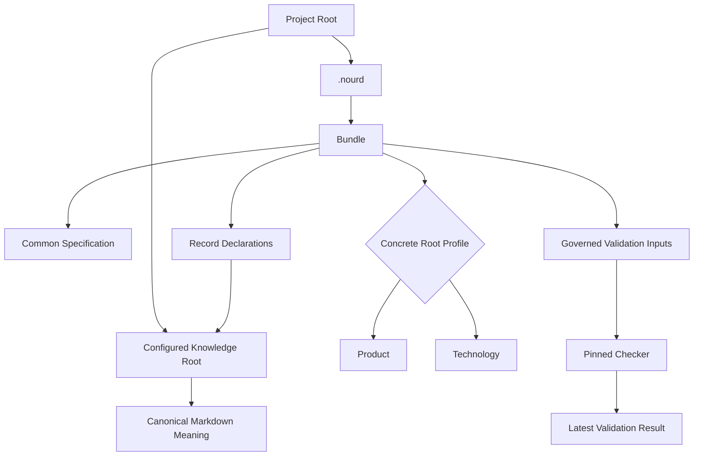
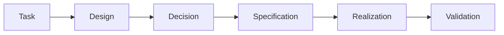

# Nourd Knowledge Format

> NKF 0.8 is pre-stable. The current checker release is internal to authorized
> Nourd projects. This public documentation is explanatory; the exact
> digest-bound [NKF 0.8 Specification](reference/nkf-0.8.md) is normative.

Nourd Knowledge Format, or NKF, is a governed way to keep important project
knowledge understandable to people and mechanically coherent for tools and AI
agents.

## What NKF Is

NKF is a human-readable knowledge format, an executable declaration model, and
a deterministic validation contract for governed project knowledge.

## Why NKF Exists

NKF exists because a folder of Markdown can look useful while quietly
drifting: a Decision may no longer match a Specification, an implementation
may not be represented, a Task may disappear from navigation, or a checker
may validate different meaning than the document a person reviewed. NKF makes
those boundaries explicit and checks their representation.

NKF is not a knowledge database, workflow engine, document viewer, AI model,
source of Product acceptance, or owner of external operational state.

## The Short Version

An adopted project has:

```text
project-root/
├── .nourd/
│   ├── knowledge/
│   │   ├── bundle.yaml
│   │   ├── records/
│   │   └── freshness/
│   │       └── baseline.yaml
│   ├── nkf-release.json
│   └── validation-result.json
└── <configured-knowledge-root>/
    ├── README.md
    ├── tasks/
    ├── designs/
    ├── decisions/
    ├── specifications/
    ├── realizations/
    └── evidence/
```

`.nourd` is always at the project root. `bundle.yaml` selects exactly one
concrete Root Profile, Product or Technology, and points to a knowledge root
inside the same project. Common NKF rules apply to both profiles. The selected
profile adds root-specific meaning and validation.

Every Markdown file in the knowledge root has exactly one record declaration
or one explicit document/non-record entry. Markdown remains canonical durable
meaning; YAML owns lifecycle, graph relationships, and freshness policy.
Task, Design, and Realization sources live at neutral stable paths such as
`tasks/items/`; generated `by-state` and `by-disposition` indexes project
their declared lifecycle state. A lifecycle transition changes declaration
state and generated navigation only — it never moves or rewrites the
canonical document.



## How Knowledge Moves

NKF uses this lifecycle:



- A **Task** owns durable intent, constraints, criteria, and execution plans.
- A **Design** proposes a direction, alternatives, and trade-offs.
- A **Decision** records why a direction was adopted, rejected, or
  superseded.
- A **Specification** defines current normative meaning.
- A **Realization** describes how that meaning is currently implemented.
- **Validation** evaluates one particular system snapshot.

An agent should start from the knowledge map and consolidated current
Realization, then follow Decisions or Designs only when it needs provenance,
rationale, or alternatives. It should not reconstruct the current system by
reading every historical file.

## Claims That Must Stay Separate

| Claim | Meaning | Who Or What Establishes It |
| --- | --- | --- |
| Accepted | An owning authority accepted an exact record revision | The declared human authority |
| Design Adopted | A Decision selected a proposed direction | An accepted Decision |
| Confirmed Realization | An authority confirmed an exact implementation account | A confirmation Decision |
| Conformant | One checker run found no blocking violation in one observed snapshot | The pinned checker result |
| NKF Verified | The required conformance and binding conditions for the stated scope were met | The accepted NKF rules and one result |
| Governing Use Ready | The accepted readiness conditions for governing use were met | The applicable authority and contract |
| Published | Bytes were observed on a distribution surface | The distribution system |
| Protected | A remote repository rule actually prevents an invalid merge | The remote repository |

None of these claims implies another unless the normative Specification says
so. A passing checker never accepts knowledge.

## Use NKF

1. Obtain `tools/nourd-nkf-adopt.mjs` and verify its SHA-256 against
   `reference/publication.json`.
2. Run the one public operation:

   ```text
   node nourd-nkf-adopt.mjs --project /absolute/path/to/project
   ```

3. For an unadopted Empty or Tiny Knowledge repository, first follow
   [Initial Onboarding](guides/initial-onboarding.md) for complete agent
   assessment and candidate sealing, then pass the sealed plan to the same
   Adopt operation.
4. If Adopt reports that your declared NKF version is inside the support
   window but behind the recommendation, complete the exact upgrade review it
   writes and rerun the same command. If it reports the version is outside
   the support window, it names the exact published stepping-stone release
   archive; migrate one hop at a time with each archive's own bundled
   adopter.
5. Author through the installed AI-neutral protocol and run
   `npm run nkf:check` before handoff.

Adopt resolves the reviewed recommendation and permanently pins the exact
content-addressed archive. It never follows a Github `latest` label. The
onboard, install, update, migrate, repair, and current paths are internal state
resolution, not public command choices.

The onboarder does not invent project meaning or acceptance decisions. When
the agent cannot recommend either supported initial category, it reports the
evidence and stops without guessing a later brownfield category.

## Documentation Map

- [Topology](concepts/topology.md) explains roots, profiles, records, semantic
  entities, Realizations, and external authority.
- [Authority And Lifecycle](concepts/authority-and-lifecycle.md) explains
  Markdown, executable contracts, Schemas, checking, the reviewed baseline,
  and claim boundaries.
- [Initial Onboarding](guides/initial-onboarding.md) covers agent-led Empty and
  Tiny Knowledge Product and Technology repositories.
- [Adopt And Validate](guides/adopt-and-validate.md) covers the single Adopt
  operation, its results, AI-assisted authoring, and validation.
- [Update And Recover](guides/update-and-recover.md) covers the in-window
  upgrade, stepping-stone migration, exact recovery, diagnosis, and failure
  safety through the same operation.
- [Product Example](examples/product/README.md) is a complete small Product
  bundle.
- [Technology Example](examples/technology/README.md) is a complete small
  Technology bundle with governed artifacts.
- [NKF 0.8 Specification](reference/nkf-0.8.md) is the exact normative
  Markdown mirror.

## Current Boundaries

- NKF 0.8 is pre-stable and may change through the governed change process.
- Live support covers exactly the current version plus one predecessor:
  NKF 0.8 and NKF 0.71. NKF 0.7 and older versions are immutable published
  history reached only through stepping-stone archives.
- Repository licensing is Apache-2.0 with informational NOTICE and retained
  compatible third-party notices. Licensing does not imply public GitHub
  visibility or a published release.
- The current checker release is private and available only to authorized
  users of `NourdApS/Nourd.NKF`.
- The exact Specification mirror preserves source-relative provenance links
  whose internal targets are intentionally absent from this public
  projection.
- The public adopter is public-safe but requires either an authenticated
  `gh` session for the private release or a locally supplied archive.
- Only Product and Technology are selectable Root Profiles. Common rules are
  shared implementation-independent meaning, not a selectable General root.
- Initial onboarding uses semantic agent assessment rather than file or byte
  thresholds. Category 2 requires human confirmation; unsupported or uncertain
  later categories remain deferred.
- Public presentation metadata, other future root models, validation expiry,
  broader secret scanning, and a protected merge gate remain outside the
  current delivered boundary.
- Github-hosted CommonMark and Mermaid are the initial documentation surface;
  a dedicated generated website may be added later.

If explanatory documentation conflicts with the exact Specification, follow
the Specification and report the documentation defect.
