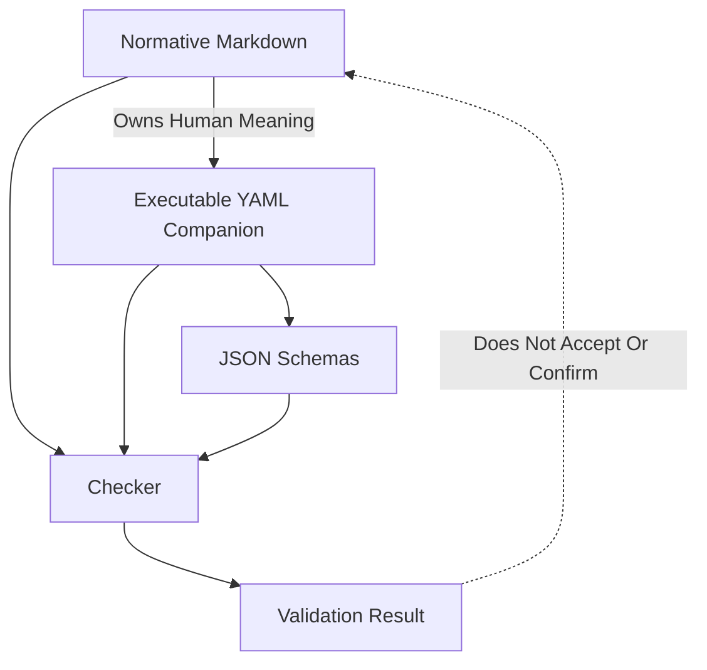
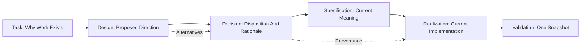
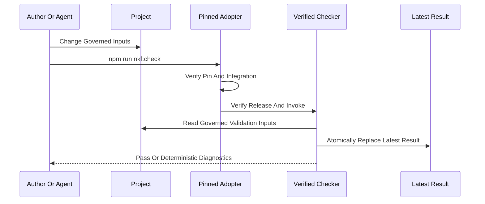

# Authority And Lifecycle

NKF works by preventing several different kinds of truth from collapsing into
one another.

## Human Meaning And Executable Meaning

The accepted Markdown Specification is authoritative human meaning. Its
digest-bound YAML companion is the executable representation. Schemas
constrain serialized instances, and the checker implements deterministic
validation.

If the YAML, Schema, checker, or guide conflicts with the normative Markdown,
that is a defect to reconcile through the governed process. The implementation
does not silently redefine the Specification.

## Knowledge Lifecycle

A Design is never current authority merely because it exists or because
someone implemented it. Its disposition must be Active, Adopted, Rejected,
Superseded, or Withdrawn.

A consolidated current-system view belongs inside Realization knowledge. It
maps current architecture, topology, components, relationships, interfaces,
artifact locations, implementation status, confirmation status, and relevant
Decision provenance. It does not compete with Specifications.

## Validation Flow

The result binds the checker, contracts, selected profile, observed snapshot,
phases, diagnostics, and conformance. Only the latest validation result is
kept in `.nourd`; freshness receipts are append-only operational state, and
historical audit or publication evidence belongs in governed Evidence when
the project needs to retain it.

## Reviewed Baseline And Review Claims

`.nourd/knowledge/freshness/baseline.yaml` is the committed digest-bound
record of the last semantic review. It binds the exact graph revision, policy
digest, the accepted version-delta declaration digest, every node revision,
relationship-category coverage, applicability judgments, and one
confirmation. Every judgment binds the exact SHA-256 revision of the judged
node and the exact digest of its cited basis, and is either `performed` —
fresh in this baseline — or `carried`. Carrying is computed, never asserted:
a judgment carries only while the judged revision, its basis digest, and
every rule it depends on are unchanged under the accepted version-delta
declaration, which classifies every checker rule between two adjacent
versions as `identical`, `mechanically-transformable`, or `semantically-new`.

The confirmation makes exactly one of three claims:

| Claim | Meaning | Fresh Review Performed |
| --- | --- | --- |
| `semantically-reviewed-whole-root` | A named reviewer judged every node and relationship category | Everything |
| `semantically-reviewed-delta` | A named reviewer judged the exact computed required-review closure; everything else carried by digest identity | The computed closure, verifiably contained in the performed set |
| `mechanically-concluded` | A deterministic Task state transition resealed the baseline over exactly its own closed delta | Nothing; every judgment carried |

The checker refuses a delta review claim whose performed set does not contain
the computed closure, and refuses a mechanically-concluded claim whose graph
delta exceeds the closed transition vocabulary; the ordinary
review-and-seal path is the recovery. A mechanically-concluded conclusion
supplies no semantic judgment — the nearest predecessor baseline carrying a
semantic claim remains the semantic provenance. The whole-root claim remains
valid at any time and is the recovery path whenever completeness is missing
or disputed.

## Acceptance Confirmation And Conformance

Acceptance is a human authority act over an exact record revision.
Confirmation is a separate authority act over an exact Realization.
Conformance is a machine observation over one snapshot.

An accepted Specification can lack a confirmed implementation. A confirmed
implementation can evaluate a nonconformant consumer. A conformant consumer
snapshot can still contain meaning its Product Owner has not accepted.

That separation is intentional.
