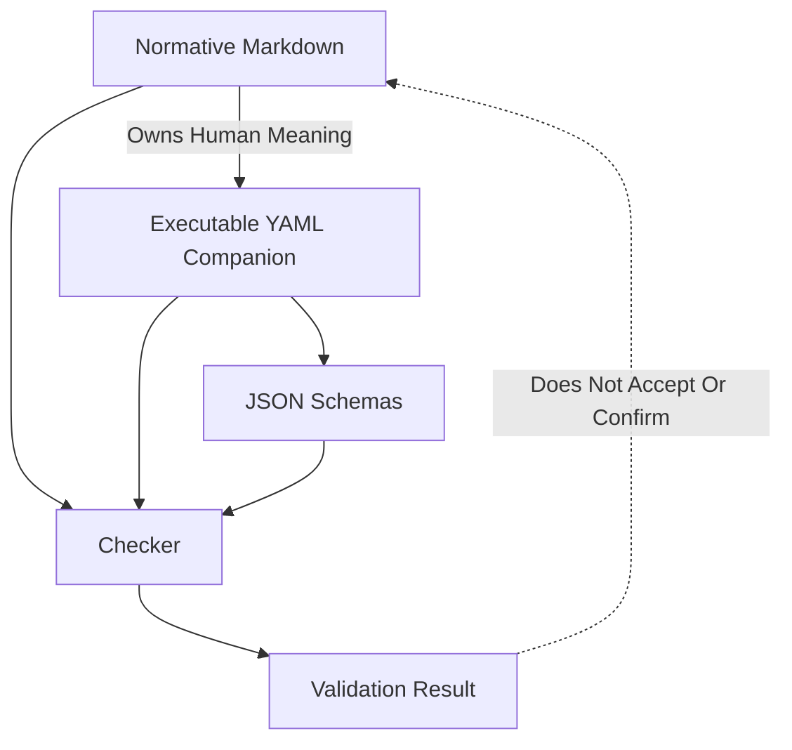
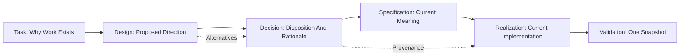
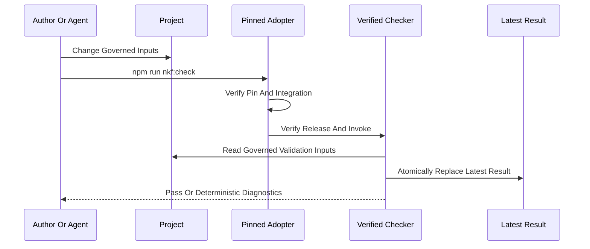

# Authority And Lifecycle

NKF works by preventing several different kinds of truth from collapsing into
one another.

## Human Meaning And Executable Meaning

The accepted Markdown Specification is authoritative human meaning. Its
digest-bound YAML companion is the executable representation. Schemas
constrain serialized instances, and the checker implements deterministic
validation.

If the YAML, Schema, checker, or guide conflicts with the normative Markdown,
that is a defect to reconcile through the governed process. The implementation
does not silently redefine the Specification.

## Knowledge Lifecycle

A Design is never current authority merely because it exists or because
someone implemented it. Its disposition must be Active, Adopted, Rejected,
Superseded, or Withdrawn.

A consolidated current-system view belongs inside Realization knowledge. It
maps current architecture, topology, components, relationships, interfaces,
artifact locations, implementation status, confirmation status, and relevant
Decision provenance. It does not compete with Specifications.

## Validation Flow

The result binds the checker, contracts, selected profile, observed snapshot,
phases, diagnostics, and conformance. Only the latest result is kept in
`.nourd`; historical audit or publication evidence belongs in governed
Evidence when the project needs to retain it.

## Acceptance Confirmation And Conformance

Acceptance is a human authority act over an exact record revision.
Confirmation is a separate authority act over an exact Realization.
Conformance is a machine observation over one snapshot.

An accepted Specification can lack a confirmed implementation. A confirmed
implementation can evaluate a nonconformant consumer. A conformant consumer
snapshot can still contain meaning its Product Owner has not accepted.

That separation is intentional.
