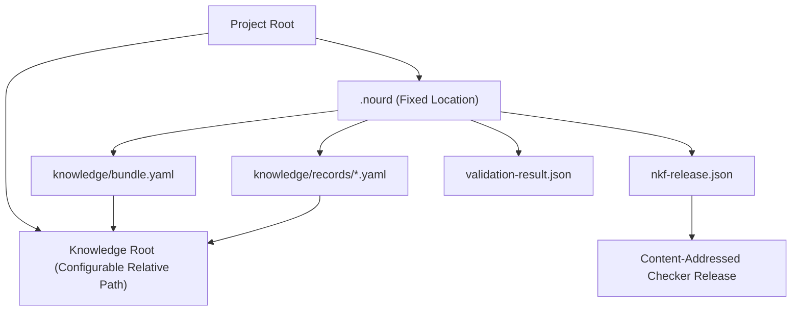
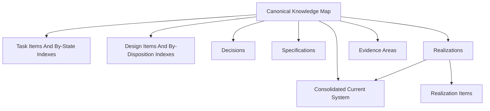
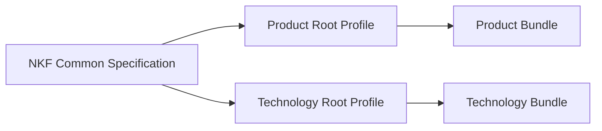
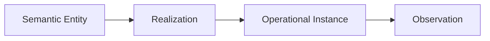

# NKF Topology

NKF separates project location, knowledge meaning, executable declarations,
derived implementation, observed validation, and external operational state.

## Project Envelope

`.nourd` must be directly under the project root. `knowledge_root` may name
any project-relative directory that remains inside the project. This allows a
future Root Profile to use a different knowledge entry point without moving
the project control boundary.

## Portable Knowledge Topology

Product and Technology use the same navigable lifecycle envelope:

`README.md` is the only canonical map. Its managed `NKF Navigation` block
links the profile root and required lifecycle entry points exactly once;
project-owned content outside that block remains project-owned. Task, Design,
and Realization sources live at neutral stable paths — `tasks/items/`,
`designs/items/`, and `realizations/items/` beside the single consolidated
`realizations/current-system.md`. Generated `tasks/by-state/` and
`designs/by-disposition/` indexes project each declared `task-status` and
`design-disposition`; Decisions, Specifications, and Realization items are
indexed by their native record declarations. A stable path or living
identifier never asserts a version, lifecycle state, disposition, or
currency, and a lifecycle transition changes only declaration state and
generated navigation — the canonical Markdown source never moves. The checker
continuously verifies this topology; it is not only an onboarding template.

## Common And Concrete Profiles

Every bundle selects exactly one concrete profile. General is the shared part
of the specification, not a selectable root type.

Product and Technology share the common envelope: project and knowledge
boundaries, Markdown coverage, record source binding, sections, semantic
topology, governance, validation, diagnostics, and authority separation.

Product adds Product meaning and responsibilities. Technology adds Technology
meaning and can declare applicable repository artifacts as Governed
Validation Inputs.

## Records Sections And Semantic Entities

A Markdown source can contain several governed sections. One record
declaration represents the complete source and binds each governed section by
heading path and occurrence.

The source can describe semantic entities such as an Intent, Capability,
Responsibility, Component, Interface, or external reference. A semantic entity
is the meaning being described, not the file or database row that carries it.

- The semantic entity is governed meaning.
- A Realization describes how that meaning is implemented.
- An operational instance is a live execution or deployed thing.
- An observation reports what happened.

NKF governs the first two as knowledge when represented in a bundle. It does
not become the authority for live runtime state merely because that state is
referenced.

## Relationships And External Authority

Record relationships express explicit semantic links. They do not copy
authority from one system to another.

For example, an NKF record may reference a deployment, ticket, API, database,
or customer record. The external system remains authoritative for its live
data, permissions, and observations. NKF owns only the governed knowledge
claim and locator represented in the project.

## Governed Validation Inputs

Governed Validation Inputs are exactly the resources that participate in an
NKF validation snapshot:

- `.nourd` declarations and supported contracts;
- every governed Markdown source under the knowledge root; and
- additional resource kinds explicitly added by an accepted profile or
  extension.

Other project assets are not hashed merely because they exist. A Technology
bundle can declare implementation or integration files as
`governed_artifacts`; accepted extensions may add later resource kinds.

The validated snapshot is calculated solely from these inputs.
