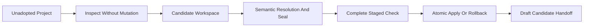

# Initial Onboarding

Initial onboarding takes an empty or small-document greenfield repository to a
complete checked NKF 0.1 candidate without requiring manual native YAML or
integration assembly.

It supports Product and Technology roots. Common rules apply to both but are
not a selectable profile.

## Supported Boundary

The selected knowledge root may contain:

- at most twenty Markdown files;
- at most 256 KiB of Markdown in total; and
- at most 64 KiB in one Markdown file.

The project must not already contain `.nourd`. Existing accepted Decisions,
Design dispositions, Specifications, Realization confirmation, Task lifecycle
history, or another mature migration boundary receives an
`NKF-ONBOARDING-DEFER-NKF-014` diagnostic. Source-rich reconstruction and
large brownfield migration are not silently attempted.

The knowledge root remains a project-contained relative path. The onboarding
workspace must be outside the project.



## Obtain The Trust Anchors

Read `release.archive_sha256` and `adopter.sha256` from
`../reference/publication.json`. Verify the downloaded public adopter before
running it. The examples below use `<release-sha256>` as the independently
trusted full archive digest.

Node.js 22 or later is required.

## Inspect An Empty Product

Choose the Product profile through project authority and run:

```sh
node nourd-nkf-adopt.mjs inspect \
  --project /absolute/path/to/project \
  --output /absolute/path/to/onboarding-workspace \
  --profile product \
  --root-id example-product \
  --root-title "Example Product" \
  --task-id EXAMPLE-001 \
  --created-at 2026-07-31T11:00:00Z
```

For a Technology, use `--profile technology` and Technology-owned identity
values. The generated Technology candidate includes a Draft Specification
because the Technology Root Profile requires one.

Inspection writes only to the separate workspace:

```text
onboarding-workspace/
├── inspection.json
├── plan.yaml
└── candidate/
```

An empty project has no existing document classifications to resolve. The plan
still records the selected profile, root, Task, authority, UTC creation time,
safe scaffold paths, and inspection digest.

The inspection result also lists existing AI instruction files, package
files and script names, workflow files, integration-owned paths, and Git
default-branch state. These relevant surfaces enter the inspection digest. If
one changes before onboarding, the plan fails as stale and must be inspected
again; unrelated source files remain uninterpreted and preserved.

## Resolve Small Existing Documentation

For a supported small knowledge root, `candidate/` contains exact copies of
every Markdown file. Each starts as unresolved in `plan.yaml`:

```yaml
representation:
  kind: unresolved
```

A human or participating AI reviews the complete corpus and changes each entry
to one explicit non-record or record representation. A navigation example is:

```yaml
representation:
  kind: non_record
  non_record_kind: navigation
```

A record representation supplies semantic declaration fields but omits
`source`; the onboarder generates the exact source path, digest, and native
YAML. Candidate Markdown edits occur only in the workspace and require project
authority where meaning changes.

The public [pre-adoption protocol](../tools/nkf-onboarding-protocol.md) and
portable onboarding skill define the complete AI-neutral procedure. The
executable never calls a model or assigns semantic authority to one provider.

## Seal Candidate Digests

After every representation is resolved and candidate edit is complete, run:

```sh
node nourd-nkf-adopt.mjs seal \
  --project /absolute/path/to/project \
  --plan /absolute/path/to/onboarding-workspace/plan.yaml
```

Sealing refreshes exact candidate SHA-256 values in the plan. Review the plan
diff before applying it. Sealing does not change the project or prove
conformance.

## Apply The Complete Candidate

With an approved offline release archive:

```sh
node nourd-nkf-adopt.mjs onboard \
  --project /absolute/path/to/project \
  --plan /absolute/path/to/onboarding-workspace/plan.yaml \
  --archive /absolute/path/to/nourd-nkf-sha256-<release-sha256>.tar \
  --sha256 <release-sha256>
```

For authenticated private download, replace `--archive` with:

```text
--github-repository kaveh6202/Nourd.NKF
```

The onboarder rechecks the original project snapshot, verifies the release,
generates the bundle and declarations, installs the authoring integration,
validates a complete isolated project at `full-bundle`, and only then replaces
project bytes. A handled post-write failure restores every predecessor byte
and removes transaction-created paths.

## Generated Product And Technology Knowledge

Both profiles receive a Draft root, active onboarding Task, knowledge map, and
unconfirmed current-system Realization. The Technology profile also receives a
Draft Specification.

The generated Realization says that onboarding did not establish an accepted
implementation mapping. It does not claim that source code or implementation
is absent.

Existing Markdown bytes are preserved unless the sealed candidate names an
exact changed digest. Existing topology is not reorganized to resemble the NKF
repository.

## Read The Result

The JSON result separates created, changed, and preserved paths; Draft and
unresolved meaning; Realization confirmation; conformance; Governing Use; and
release digests.

A normal initial result has:

```json
{
  "state": "onboarded",
  "meaning": {
    "root_status": "draft",
    "classification_status": "resolved",
    "substantive_meaning": "contains-unresolved",
    "realization_confirmation": "unconfirmed"
  },
  "validation": {
    "conformance": "passed",
    "governing_use": "not-ready"
  }
}
```

Repeating the exact sealed plan verifies the installed candidate and returns
`no-update`. A different plan against an adopted repository requires governed
authoring or deliberate migration.

Successful onboarding does not accept the Draft root, accept a Specification,
adopt a Design, confirm the Realization, commit Git history, push a branch, or
activate remote merge protection.

## Complete Supported Examples

The same inspect, resolve, seal, and onboard sequence above covers all four
supported starting examples:

| Starting Example | Profile | Plan Resolution | Generated Minimum |
| --- | --- | --- | --- |
| Empty Product | `product` | No existing document entries | Draft Product root, onboarding Task, map, and unconfirmed current-system Realization |
| Empty Technology | `technology` | No existing document entries | Draft Technology root, Draft initial Specification, onboarding Task, map, and unconfirmed current-system Realization |
| Small-document Product | `product` | Resolve every existing Markdown entry | Product minimum plus every resolved existing representation |
| Small-document Technology | `technology` | Resolve every existing Markdown entry | Technology minimum plus every resolved existing representation |

For the small-document examples, create `knowledge/notes/overview.md` before
inspection, follow **Resolve Small Existing Documentation**, classify it as
the shown navigation non-record, and then run the exact seal and onboard
commands. The original file path and bytes are preserved. The NKF repository
executes all four examples as part of its adopter tests; publication binds the
tested adopter by SHA-256.
