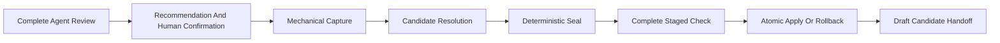

# Initial Onboarding

Initial onboarding takes an unadopted Empty Repository or Tiny Knowledge, No
Source Or Configuration repository to a complete checked NKF 0.4 candidate
without requiring manual native YAML or integration assembly.

It supports Product and Technology roots. Common rules apply to both but are
not a selectable profile.

## Understand The Boundary

The portable onboarding skill—not a deterministic classifier—guides the
initial repository assessment:

- **Empty Repository:** no useful knowledge, meaningful source implementation,
  or project configuration. Incidental placeholder material may exist.
- **Tiny Knowledge, No Source Or Configuration:** a small knowledge corpus that
  an agent can review completely and no meaningful source implementation or
  project configuration.

`Tiny` is a semantic reviewability judgment, not a fixed file or byte limit.
The agent reads the complete repository, distinguishes knowledge, source,
configuration, incidental material, and unresolved items, and explains its
evidence. Category 2 always requires human confirmation. Category 1 may
proceed without a separate confirmation after an explained effectively-empty
finding.

If neither category is supportable, the agent stops without guessing a later
category and refers future work to deferred NKF-014. A human may deliberately
override a negative or indeterminate Category 2 recommendation; mechanical
safety failures cannot be overridden.

The project must not already contain `.nourd`. The knowledge root remains a
project-contained relative path, and the candidate workspace stays outside the
project.



## Obtain The Trust Anchors

Read `release.archive_sha256` and `adopter.sha256` from
`../reference/publication.json`. Verify the downloaded public adopter before
running it. The examples use `<release-sha256>` as the independently trusted
full archive digest.

Node.js 22 or later is required.

## Run The Agent-Led Assessment

Use the published `nkf-onboarding` skill. It routes every supported AI host to
the same vendor-neutral
[pre-adoption protocol](../tools/nkf-onboarding-protocol.md).

The agent reads every project entry except version-control implementation
metadata. It must not sample files or decide from filenames, directory names,
frontmatter, or numeric thresholds. Before proceeding, it reports:

1. knowledge, source, configuration, incidental, and unresolved findings;
2. its Category 1 or Category 2 recommendation, or why neither is recommended;
3. exact evidence paths; and
4. the required Category 2 confirmation or override.

Project authority separately selects Product or Technology, the root identity,
knowledge root, Task identity, and authority values. Repository contents do
not select the Root Profile.

## Capture A Mechanical Workspace

After the assessment and required confirmation, run:

```sh
node nourd-nkf-adopt.mjs inspect \
  --project /absolute/path/to/project \
  --output /absolute/path/to/onboarding-workspace \
  --profile product \
  --root-id example-product \
  --root-title "Example Product" \
  --task-id EXAMPLE-001 \
  --created-at 2026-07-31T14:00:00Z
```

For a Technology, use `--profile technology` and Technology-owned identity
values. The generated Technology candidate includes a Draft Specification
because the Technology Root Profile requires one.

The retained `inspect` name means mechanical source capture, not a semantic
survey. It writes only to the separate workspace:

```text
onboarding-workspace/
├── inspection.json
├── plan.yaml
└── candidate/
```

Require `mechanically_ready: true`. `inspection.json` includes a complete
project entry manifest, excluding version-control implementation metadata,
plus integration surfaces and Git binding. Compare it with the agent's review.
Any later project change makes the plan stale.

## Record The Assessment

Replace the unresolved `assessment` mapping in `plan.yaml`.

For Empty Repository:

```yaml
assessment:
  category: empty-repository
  assessed_by: participating-agent
  assessed_at: 2026-07-31T14:01:00Z
  recommendation: recommended
  summary: The complete repository contains only incidental placeholder material.
  evidence:
    - subject: README.md
      classification: incidental
      finding: The file contains only generic placeholder text.
  confirmation:
    status: not-required
```

For confirmed Tiny Knowledge:

```yaml
assessment:
  category: tiny-knowledge-no-source-or-configuration
  assessed_by: participating-agent
  assessed_at: 2026-07-31T14:01:00Z
  recommendation: recommended
  summary: The repository contains one completely reviewed early knowledge set.
  evidence:
    - subject: knowledge/
      classification: knowledge
      finding: Every document was read in one complete review.
  confirmation:
    status: confirmed
    authority: human-product-owner
    confirmed_at: 2026-07-31T14:05:00Z
    override: false
    rationale: The authority confirms Category 2 for this exact snapshot.
```

For a human-directed override, keep `not-recommended` or `indeterminate`, set
`override: true`, and record the rationale. Do not rewrite the agent's finding.

The plan is operational candidate state. The executable validates its
completeness but cannot prove the category assessment is true.

## Resolve Existing Markdown

For Tiny Knowledge, `candidate/` contains exact copies of every Markdown file
under the selected knowledge root. Each starts unresolved in `plan.yaml`:

```yaml
representation:
  kind: unresolved
```

The agent changes every entry to exactly one record or `non_records`
representation. A navigation example is:

```yaml
representation:
  kind: non_record
  non_record_kind: navigation
```

A record representation supplies semantic declaration fields but omits
`source`; the onboarder generates the exact source path, digest, and native
YAML. Candidate Markdown edits occur only in the workspace and require project
authority where meaning changes.

The initial plan selects non-conflicting scaffold paths. If complete review
establishes that an existing document is already the safe Draft Product or
Technology root, select that existing relative path as `scaffold.root_record`
and give the document the matching Draft root declaration. A Technology
repository may similarly select an existing safe Draft Specification through
`scaffold.initial_specification`. The onboarder then preserves those exact
candidate bytes and does not create a duplicate root or Specification. Keep the
generated scaffold path when the existing document's identity, authority,
status, or role is ambiguous.

## Seal Candidate Digests

Capture and sealing are internal agent mechanics used to prepare the one
public Adopt operation; they are not alternative user adoption commands.

Run:

```sh
node nourd-nkf-adopt.mjs seal \
  --project /absolute/path/to/project \
  --plan /absolute/path/to/onboarding-workspace/plan.yaml
```

Sealing verifies the assessment and applicable confirmation, recreates the
complete mechanical snapshot, requires every Markdown representation, and
refreshes exact candidate digests. It does not change the project, prove the
semantic category, or establish conformance.

## Apply The Complete Candidate With Adopt

For authenticated access to the governed recommendation and private release:

```sh
node nourd-nkf-adopt.mjs \
  --project /absolute/path/to/project \
  --plan /absolute/path/to/onboarding-workspace/plan.yaml
```

For an approved offline recommendation and archive:

```sh
node nourd-nkf-adopt.mjs \
  --project /absolute/path/to/project \
  --plan /absolute/path/to/onboarding-workspace/plan.yaml \
  --recommendation /absolute/path/to/recommended.json \
  --archive /absolute/path/to/nourd-nkf-sha256-<release-sha256>.tar
```

Adopt repeats source and candidate checks, verifies the recommendation and
release,
generates the bundle and declarations, installs authoring integration,
validates a complete isolated project at `full-bundle`, and only then replaces
project bytes. A handled failure restores predecessor bytes and removes
transaction-created paths.

Every successful initial onboarding creates the complete portable topology:

```text
<knowledge-root>/
├── README.md
├── tasks/
│   ├── README.md
│   ├── active/README.md
│   ├── deferred/README.md
│   ├── completed/README.md
│   └── cancelled/README.md
├── designs/
│   ├── README.md
│   ├── active/README.md
│   ├── adopted/README.md
│   ├── rejected/README.md
│   ├── superseded/README.md
│   └── withdrawn/README.md
├── decisions/README.md
├── specifications/README.md
├── realizations/
│   ├── README.md
│   ├── current-system.md
│   └── current/README.md
└── evidence/README.md
```

The canonical `README.md` contains one managed `NKF Navigation` block. If the
file already exists, the onboarder reconciles that block in the same document
and preserves project-owned bytes outside it. It never allocates
`README-2.md`. Ambiguous existing meaning or representation stops before
mutation.

## Read The Result

The result keeps the plan-supplied category separate from mechanical proof and
NKF conformance:

```json
{
  "state": "onboarded",
  "onboarding_assessment": {
    "category": "tiny-knowledge-no-source-or-configuration",
    "recommendation": "recommended",
    "confirmation": "confirmed",
    "mechanically_proven": false
  },
  "meaning": {
    "root_status": "draft",
    "realization_confirmation": "unconfirmed"
  },
  "validation": {
    "conformance": "passed",
    "governing_use": "not-ready"
  }
}
```

Both profiles receive a Draft root, active onboarding Task, complete knowledge
topology, and unconfirmed current-system Realization. Technology also receives
a Draft Specification. Existing project-owned bytes are preserved unless the
sealed candidate names an exact change or the managed navigation/index
reconciliation is required by NKF.

After success, rerunning Adopt without `--plan` verifies the installed
candidate and returns `current`. Successful onboarding does not accept the Draft root, accept a
Specification, adopt a Design, confirm the Realization, commit Git history,
push a branch, or activate remote merge protection.
